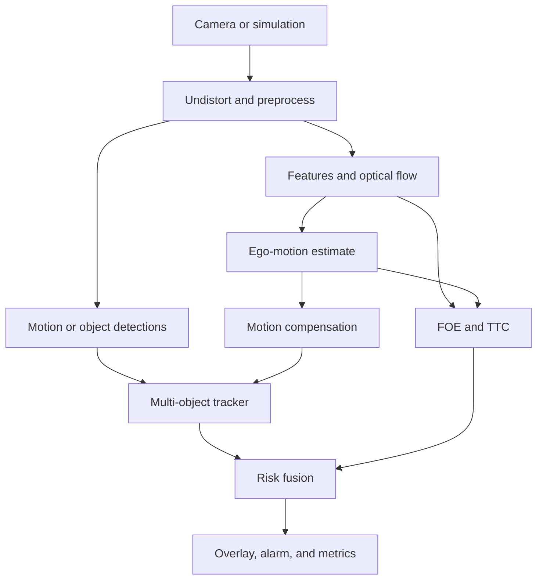
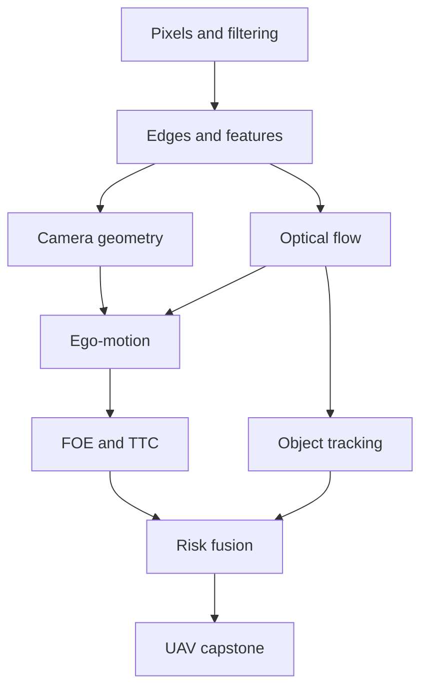

# Classical Computer Vision with Modern C++ and OpenCV

## Detailed Curriculum and Project Roadmap

**Primary language:** Modern C++20  
**Core library:** OpenCV 4.x  
**Duration:** approximately 220–260 hours  
**Format:** 20 deep modules, each requiring 10–14 hours  
**Application focus:** robotics, UAV vision, motion analysis, object tracking, visual navigation, and time-to-collision (TTC)

---

## 1. Course Mission

The goal is not to memorize OpenCV functions. The goal is to understand how classical computer-vision algorithms work, implement their essential parts, measure their behavior, and combine them into systems that solve real problems.

The final system processes a monocular UAV video stream and performs three connected jobs:

1. Detect and track moving objects.
2. Estimate camera and scene motion for visual navigation.
3. Estimate TTC and issue a collision warning.

Deep learning is deliberately excluded from the main pipeline. It may be discussed only as a comparison or optional extension.

## 2. Learning Method

Every module follows the same engineering cycle:

1. **Understand:** derive the idea using diagrams, geometry, or small numeric examples.
2. **Implement:** build the central algorithm using arrays, loops, and modern C++.
3. **Compare:** run the equivalent OpenCV implementation and compare correctness and speed.
4. **Apply:** solve a realistic image or video problem.
5. **Measure:** define metrics and test failure cases.
6. **Reflect:** complete a short quiz and explain the algorithm in your own words.

### Implementation rule

- Implement the educational core yourself when this reveals how the algorithm works.
- Use OpenCV for image/video I/O, display, camera access, drawing, and reference implementations.
- Use production OpenCV routines after the manual implementation is understood and tested.
- Avoid rebuilding low-level codecs, GUI systems, or highly optimized linear-algebra kernels.

## 3. Prerequisites

### Required C++

- Values, references, pointers, RAII, and containers
- Classes, templates, lambdas, and algorithms
- `std::span`, `std::optional`, `std::variant`, and smart pointers
- CMake targets and basic unit testing
- Basic debugging and profiling

### Required mathematics

- Vectors and matrices
- Dot product, norms, and matrix multiplication
- Basic derivatives and gradients
- Coordinate systems and rigid transformations
- Mean, variance, Gaussian noise, and least squares

The course introduces the vision-specific mathematics as it is needed.

## 4. Development Environment

Recommended stack:

- Ubuntu 24.04
- C++20 compiler: GCC or Clang
- CMake and Ninja
- OpenCV 4.x
- Eigen for selected geometry and estimation exercises
- Catch2 or GoogleTest
- `clang-format`, `clang-tidy`, and sanitizers
- VS Code with CMake Tools

Suggested repository layout:

```text
classic-cv-course/
├── CMakeLists.txt
├── cmake/
├── common/
│   ├── include/
│   ├── src/
│   └── tests/
├── modules/
│   ├── 01_image_foundations/
│   ├── 02_intensity_color/
│   └── ...
├── projects/
│   ├── motion_detector/
│   ├── feature_tracker/
│   ├── ttc_estimator/
│   └── uav_vision_capstone/
├── datasets/
├── tools/
└── docs/
```

Each module should contain:

```text
README.md        # concepts, derivations, and instructions
src/             # implementation
include/         # public interfaces
tests/           # unit and regression tests
apps/            # runnable demonstrations
assets/          # small permitted test assets
results/         # plots, measurements, and observations
quiz.md
lab.md
```

## 5. Course Roadmap

| Phase | Modules | Main capability | Phase project |
|---|---:|---|---|
| A. Image foundations | 1–4 | Represent, transform, filter, and segment images | Inspection and segmentation tool |
| B. Structure and geometry | 5–8 | Extract edges/features and understand cameras | Planar measurement system |
| C. Motion and tracking | 9–13 | Detect motion, estimate flow, and track targets | Robust multi-cue tracker |
| D. Navigation and TTC | 14–17 | Estimate ego-motion, focus of expansion, and collision risk | Visual collision-warning system |
| E. Systems engineering | 18–20 | Evaluate, optimize, and integrate the full pipeline | UAV vision capstone |

---

# Phase A — Image Foundations

## Module 1 — Images, Memory, and the Vision Pipeline

**Estimated effort:** 10–12 hours

### Outcomes

- Explain pixels, channels, depth, stride, and contiguous memory.
- Distinguish RGB, BGR, grayscale, and planar/interleaved layouts.
- Safely move between a custom image buffer and `cv::Mat`.
- Build a reproducible command-line image-processing application.

### Build from first principles

- `Image<T>` view backed by `std::vector` or `std::span`
- Pixel indexing with bounds checks in debug builds
- RGB/BGR-to-grayscale conversion
- Nearest-neighbor resizing

### Practical labs

1. Load an image with OpenCV, convert it to a custom buffer, compute grayscale manually, and display the result.
2. Diagnose a deliberately broken stride/channel implementation.
3. Compare manual and OpenCV output using absolute-difference images.
4. Benchmark row-major iteration patterns.

### Real problem

Create an image-inspection utility that reports resolution, type, channel order, stride, min/max, mean, histogram, and possible clipping.

### Acceptance check

- Manual grayscale differs from the reference by no more than one intensity level per pixel.
- AddressSanitizer and UndefinedBehaviorSanitizer report no errors.

## Module 2 — Intensity, Color, Histograms, and Illumination

**Estimated effort:** 10–12 hours

### Outcomes

- Understand intensity distributions and color-space tradeoffs.
- Improve contrast without destroying important details.
- Separate chromatic information from brightness.

### Algorithms

- Histogram calculation and normalization
- Linear contrast stretching
- Gamma correction
- Histogram equalization
- HSV and YCrCb thresholding
- Optional: CLAHE behavior study

### Practical labs

1. Implement a grayscale histogram and cumulative distribution function.
2. Implement global histogram equalization and compare it with OpenCV.
3. Build an HSV color-picker with interactive thresholds.
4. Test detection under daylight, shadow, and warm indoor lighting.

### Real problem

Detect a colored landing marker despite moderate illumination change.

### Metrics

- Intersection-over-union (IoU) against a hand-labeled mask
- False-positive pixel ratio
- Sensitivity to brightness and white-balance changes

## Module 3 — Convolution, Noise, and Spatial Filtering

**Estimated effort:** 12–14 hours

### Outcomes

- Explain convolution, kernels, borders, and separability.
- Select filters based on the expected noise model.
- Measure the compromise between denoising and detail loss.

### Build from first principles

- Generic 2D convolution for single-channel images
- Box filter
- Gaussian-kernel generator
- Separable Gaussian filter
- Median filter

### Practical labs

1. Add Gaussian, salt-and-pepper, and impulse noise.
2. Compare box, Gaussian, median, and bilateral filtering.
3. Measure PSNR and structural/detail loss.
4. Profile naive versus separable convolution.

### Real problem

Stabilize feature detection on noisy, low-light UAV imagery.

## Module 4 — Thresholding, Morphology, and Connected Components

**Estimated effort:** 12–14 hours

### Outcomes

- Turn uncertain pixel evidence into clean regions.
- Explain erosion, dilation, opening, and closing geometrically.
- Extract blobs and reject them using shape statistics.

### Build from first principles

- Global and adaptive thresholding
- Otsu threshold search
- Binary erosion and dilation
- Flood-fill or two-pass connected-component labeling
- Area, centroid, bounding box, and aspect ratio

### Practical labs

1. Segment printed parts on a workbench.
2. Remove isolated noise while preserving the target.
3. Count and measure connected objects.
4. Compare thresholds under uneven illumination.

### Phase project A

Build a configurable object-segmentation tool that reads images or video, produces masks and bounding boxes, records parameters, and exports quantitative results.

---

# Phase B — Structure and Geometry

## Module 5 — Image Gradients and Edge Detection

**Estimated effort:** 12–14 hours

### Outcomes

- Relate derivatives to intensity changes.
- Compute gradient magnitude and orientation.
- Explain every stage of Canny edge detection.

### Build from first principles

- Finite differences, Sobel, and Scharr-style gradients
- Gradient magnitude and direction
- Non-maximum suppression
- Double threshold and hysteresis
- Simplified Canny pipeline

### Real problem

Detect corridor, road, or runway boundaries from a forward-facing camera.

### Failure study

Analyze shadows, texture, blur, weak contrast, and threshold sensitivity.

## Module 6 — Lines, Shapes, and the Hough Transform

**Estimated effort:** 10–12 hours

### Outcomes

- Move from edge pixels to geometric structure.
- Understand parameter-space voting.
- Use robust shape constraints to reduce false detections.

### Algorithms

- Standard and probabilistic Hough line transforms
- Circle detection concepts
- Contour extraction and polygon approximation
- Line intersection and vanishing-point introduction

### Practical labs

1. Implement a basic line Hough accumulator.
2. Detect lane/runway boundaries.
3. Estimate corridor center from two dominant lines.
4. Detect circular markers and reject ellipses/noise.

### Real problem

Estimate lateral alignment with a runway or indoor corridor.

## Module 7 — Corners, Keypoints, and Descriptors

**Estimated effort:** 12–14 hours

### Outcomes

- Explain why corners are trackable and edges are ambiguous.
- Derive the second-moment matrix.
- Detect, describe, and match repeatable image points.

### Build from first principles

- Harris response
- Shi–Tomasi score
- Non-maximum suppression and spatial distribution
- Patch descriptor with normalization

### OpenCV comparison

- `goodFeaturesToTrack`
- ORB detector and binary descriptors
- Brute-force matching and ratio/cross-check strategies

### Real problem

Match a reference landing-zone image against a live camera frame.

### Metrics

- Repeatability under rotation, scaling, blur, and illumination change
- Match precision after geometric verification
- Spatial coverage of selected features

## Module 8 — Camera Geometry, Calibration, and Planar Mapping

**Estimated effort:** 14–16 hours

### Outcomes

- Use the pinhole camera model and intrinsic matrix.
- Explain radial/tangential distortion.
- Calibrate a camera and interpret reprojection error.
- Use homography for planar measurements and perspective correction.

### Build and derive

- 3D-to-2D projection
- Pixel-to-normalized-coordinate conversion
- Four-point homography application
- Reprojection error calculation

### Practical labs

1. Generate a synthetic calibration scene.
2. Calibrate a physical or simulated camera.
3. Undistort images and compare straight edges.
4. Produce a bird’s-eye view of a planar floor or road.

### Phase project B

Create a calibrated planar-measurement system that estimates the size and position of objects on a known plane and reports uncertainty from reprojection error.

---

# Phase C — Motion and Tracking

## Module 9 — Video, Temporal Processing, and Background Modeling

**Estimated effort:** 10–12 hours

### Outcomes

- Treat video as a time sequence rather than independent images.
- Separate moving foreground from a mostly static background.
- Understand ghosting, adaptation, and camera-motion limitations.

### Algorithms

- Frame differencing
- Running average background
- Running variance model
- MOG2/KNN comparison
- Temporal mask filtering

### Real problem

Detect vehicles or people from a fixed surveillance or landing-area camera.

### Metrics

- Detection precision/recall against selected labeled frames
- Detection delay
- Recovery time after illumination change

## Module 10 — Lucas–Kanade Sparse Optical Flow

**Estimated effort:** 14–16 hours

### Outcomes

- Derive the brightness-constancy equation.
- Understand the aperture problem and conditioning.
- Implement iterative Lucas–Kanade for small motion.
- Extend it using pyramids for larger displacement.

### Build from first principles

- Spatial and temporal gradients
- Windowed least-squares velocity estimate
- Minimum-eigenvalue validity test
- Iterative refinement
- Image pyramid and coarse-to-fine flow

### Practical labs

1. Use synthetic translated images with known ground truth.
2. Visualize feature tracks and residuals.
3. Reject inconsistent tracks using forward-backward error.
4. Study blur, frame rate, texture, and displacement.

### Real problem

Track ground features beneath a moving UAV.

## Module 11 — Dense Optical Flow and Motion Fields

**Estimated effort:** 12–14 hours

### Outcomes

- Interpret a dense vector field.
- Compare local and global flow assumptions.
- Separate coherent motion from noise.

### Topics

- Horn–Schunck energy intuition and simplified implementation
- Farnebäck optical flow
- Flow visualization using vectors and HSV
- Divergence, curl, and spatial flow statistics
- Region-wise motion aggregation

### Real problem

Detect approaching image regions and independently moving obstacles.

## Module 12 — Single-Object Tracking with Classical Cues

**Estimated effort:** 12–14 hours

### Outcomes

- Distinguish detection from tracking.
- Track appearance using color, templates, and local search.
- Recognize drift and define a confidence score.

### Algorithms

- Template matching
- Normalized cross-correlation
- Color histogram and back-projection
- MeanShift and CamShift
- MOSSE/KCF concepts and OpenCV comparison

### Real problem

Track a selected vehicle or ground target from an aerial video.

### Required failure recovery

- Low-confidence state
- Search-region expansion
- Reinitialization hook
- Target-lost output rather than a misleading bounding box

## Module 13 — Multi-Object Tracking and State Estimation

**Estimated effort:** 14–16 hours

### Outcomes

- Maintain target identity through missed detections.
- Predict motion with a Kalman filter.
- Associate detections and tracks using explicit costs.

### Build from first principles

- Constant-velocity state model
- Kalman predict/update cycle
- IoU and centroid-distance association
- Gating
- Greedy assignment, then Hungarian-method usage
- Track lifecycle: tentative, confirmed, lost, deleted

### Phase project C

Build a multi-cue vehicle tracker that combines motion segmentation, blob detections, optical flow, and Kalman prediction. Evaluate identity switches, missed tracks, localization error, and processing speed.

---

# Phase D — Visual Navigation and TTC

## Module 14 — Robust Estimation with RANSAC

**Estimated effort:** 10–12 hours

### Outcomes

- Explain why ordinary least squares fails with outliers.
- Implement generic RANSAC.
- Estimate dominant image motion robustly.

### Models

- 2D translation
- Affine transform
- Homography
- Optional fundamental-matrix introduction

### Real problem

Separate camera-induced background motion from independently moving vehicles.

## Module 15 — Ego-Motion from Features and Optical Flow

**Estimated effort:** 14–16 hours

### Outcomes

- Explain rotational versus translational image motion.
- Estimate a robust global motion model.
- Compensate video and extract residual motion.
- Understand the scale ambiguity of monocular vision.

### Practical labs

1. Estimate frame-to-frame affine/homography motion.
2. Stabilize a shaky sequence.
3. Compare raw flow with motion-compensated residual flow.
4. Fuse known camera height or speed to recover metric quantities in restricted cases.

### Real problem

Estimate UAV image-plane motion and distinguish ego-motion from moving objects.

## Module 16 — Focus of Expansion and Time-to-Contact Geometry

**Estimated effort:** 14–16 hours

### Outcomes

- Understand motion expansion during forward translation.
- Estimate the focus of expansion (FOE).
- Derive TTC from image scale change and optical flow.
- State the assumptions under which TTC is observable.

### Build from first principles

- FOE from intersections of flow lines using robust estimation
- Radial-flow decomposition
- TTC from feature radius: `tau = r / r_dot`
- TTC from apparent scale: `tau ≈ delta_t / (s - 1)` for small frame intervals and consistent definitions
- Robust aggregation using medians and confidence intervals

### Synthetic lab

Generate an image sequence of a textured plane or object approaching the camera with known speed and depth. Compare estimated TTC with ground truth over noise, blur, rotation, and frame-rate changes.

### Real problem

Produce a monocular collision-risk estimate without requiring absolute distance.

## Module 17 — Collision Logic, Uncertainty, and Sensor Fusion

**Estimated effort:** 12–14 hours

### Outcomes

- Convert noisy TTC estimates into stable decisions.
- Reject physically inconsistent measurements.
- Combine multiple cues without hiding uncertainty.

### Topics

- Median/MAD outlier rejection
- Exponential smoothing versus Kalman filtering
- TTC confidence from track age, residual, and spatial coverage
- Hysteresis and persistence for alarm decisions
- Image-region risk maps
- Optional fusion with IMU rotation and altimeter/range data

### Phase project D

Build a visual collision-warning system that overlays FOE, tracked features, regional TTC, confidence, and alarm state. Validate it on synthetic ground truth before testing real video.

---

# Phase E — Engineering and Integration

## Module 18 — Evaluation, Datasets, and Reproducible Experiments

**Estimated effort:** 10–12 hours

### Outcomes

- Define metrics before tuning an algorithm.
- Build repeatable dataset and configuration handling.
- Separate training/tuning clips from final evaluation clips, even without machine learning.

### Metrics toolbox

- Segmentation: IoU, precision, recall, F1
- Detection: precision, recall, localization IoU
- Tracking: center error, success rate, identity switches, lost-track rate
- Optical flow: endpoint error when ground truth exists
- TTC: MAE, relative error, warning lead time, missed-danger rate, false-alarm rate
- Runtime: latency distribution, throughput, CPU usage, and memory

### Deliverable

A common evaluation executable that reads ground truth and produces CSV results, plots, and a Markdown experiment report.

## Module 19 — Real-Time C++ Vision Architecture and Optimization

**Estimated effort:** 12–14 hours

### Outcomes

- Design a pipeline whose timing behavior is visible and testable.
- Avoid accidental copies and unbounded queues.
- Profile before optimizing.

### Topics

- Capture, processing, visualization, and logging stages
- Ownership using RAII and immutable frame metadata
- Bounded producer-consumer queues
- Timestamping and frame IDs
- `cv::Mat` shallow copies, ROIs, continuity, and allocation reuse
- Resolution, ROI, pyramid, and frame-skipping tradeoffs
- Compiler optimization and SIMD-aware data access
- Benchmarking individual stages and end-to-end latency

### Practical lab

Convert one earlier single-threaded application into a bounded real-time pipeline. Demonstrate predictable overload behavior by dropping stale frames rather than accumulating latency.

## Module 20 — Integrated UAV Vision Capstone

**Estimated effort:** 25–40 hours

### System objective

Build one classical vision application for a forward- or downward-facing UAV camera that:

1. Ingests recorded video, a camera, or a Gazebo Transport stream.
2. Calibrates/undistorts the imagery.
3. Detects and tracks meaningful moving objects.
4. Estimates global camera motion and compensated residual motion.
5. Computes sparse or dense optical flow.
6. Estimates FOE and regional TTC.
7. Produces a stable collision-risk state.
8. Displays results and records synchronized metrics.

### Recommended pipeline



### Capstone milestones

#### Milestone 1 — Scenario and ground truth

- Define camera direction, scene, speeds, and expected hazards.
- Create at least three synthetic scenarios with known TTC.
- Select at least two real sequences for qualitative validation.
- Write metrics and success thresholds before implementation.

#### Milestone 2 — Input and calibration

- Unified frame source interface
- Stable timestamps and frame IDs
- Camera calibration and undistortion
- Recorded-video replay mode for repeatable debugging

#### Milestone 3 — Motion and tracking

- Feature detection and pyramidal Lucas–Kanade
- Forward-backward and geometric outlier rejection
- Global camera-motion estimate
- Moving-region or blob detections
- Kalman-based object tracks

#### Milestone 4 — TTC subsystem

- FOE estimation
- Regional radial-flow selection
- Per-feature TTC and robust aggregate
- Confidence estimation
- Synthetic ground-truth evaluation

#### Milestone 5 — Decision and integration

- Risk zones and alarm thresholds
- Persistence/hysteresis logic
- Tracking and TTC fusion
- Debug overlay showing why an alarm occurred

#### Milestone 6 — Real-time engineering

- Per-stage timing instrumentation
- Bounded latency
- Parameter configuration file
- Result logging and deterministic replay
- Performance at the selected target resolution and frame rate

### Minimum acceptance criteria

The exact numeric thresholds should be finalized after the first dataset survey. Initial targets:

- Runs at 30 FPS on the development PC at a justified resolution.
- No unbounded growth in memory or latency.
- Reports target-lost and low-confidence states explicitly.
- Median synthetic TTC relative error below 15% in clean forward-motion scenarios.
- Median synthetic TTC relative error below 25% with moderate image noise and small rotation.
- Collision warning occurs at least one second before simulated contact in the selected test envelope.
- False alarms are measured and remain below the chosen scenario-specific limit.
- Moving-object tracks survive short detection gaps without excessive identity switching.
- Every reported metric can be regenerated using one documented command.

### Final demonstration scenarios

1. **Straight approach:** camera moves toward a static textured obstacle.
2. **Rotation contamination:** approach plus yaw/pitch motion.
3. **Crossing object:** vehicle crosses the UAV path.
4. **Lead vehicle:** tracked object moves in the same direction at a different speed.
5. **Low texture:** TTC confidence must fall rather than produce false certainty.
6. **Lighting/noise change:** preprocessing and tracking robustness test.

---

## 6. Assessment Strategy

### Per-module assessment

- Concept quiz: 10–15 questions
- Derivation or reasoning exercise
- Implementation lab
- Real-problem challenge
- Automated correctness tests
- Performance measurement
- Short failure-analysis report

### Weighting

| Component | Weight |
|---|---:|
| Quizzes and explanations | 10% |
| Manual algorithm implementations | 20% |
| Module labs | 25% |
| Phase projects | 20% |
| Final capstone | 25% |

### Definition of done for an algorithm

An algorithm is not complete until the learner can:

- Explain its assumptions.
- Implement or derive its essential mechanism.
- Compare it with a reference.
- Select meaningful parameters.
- Measure its result.
- Identify at least three failure modes.
- State when a different algorithm should be used.

## 7. Suggested Dataset Strategy

Use three kinds of data throughout the course:

### Controlled synthetic data

Best for gradients, optical flow, geometry, and TTC because exact ground truth is available. Generate translations, rotations, scale changes, noise, blur, and known camera approach trajectories.

### Small curated real clips

Record short clips for each concept: static camera motion detection, hand-selected target tracking, corridor/runway lines, forward approach, and aerial motion. Small clips make debugging fast and repeatable.

### Public benchmark subsets

Use small, properly attributed subsets selected for a specific metric. Suitable families include optical-flow benchmarks, object-tracking datasets, autonomous-driving sequences, and UAV video datasets. Dataset selection and current licenses should be checked when each module is authored.

## 8. Recommended Learning Schedule

### Sustainable track: 24–30 weeks

- 8–10 hours per week
- One deep module most weeks
- Extra weeks for phase projects and capstone

### Intensive track: 14–18 weeks

- 15–20 hours per week
- Some foundation modules paired
- Dedicated final three weeks for integration and evaluation

Do not compress Modules 8, 10, 13, 15, or 16; they contain the geometry and estimation foundations of the capstone.

## 9. Dependency Map



## 10. Course Production Roadmap

The curriculum should be authored in increments rather than writing all theory first.

### Release 0 — Course skeleton

- Repository, CMake presets, formatting, tests, and common utilities
- Module README template
- Lab, quiz, and result-report templates
- Small asset and dataset-download policy

### Release 1 — Foundations

- Complete Modules 1–4
- Publish Phase Project A
- Verify the build on a clean Ubuntu environment

### Release 2 — Features and geometry

- Complete Modules 5–8
- Add synthetic camera/calibration generator
- Publish Phase Project B

### Release 3 — Motion and tracking

- Complete Modules 9–13
- Establish common video replay and annotation formats
- Publish Phase Project C

### Release 4 — Navigation and TTC

- Complete Modules 14–17
- Add TTC sequence generator with exact ground truth
- Publish Phase Project D

### Release 5 — Integration

- Complete Modules 18–20
- Add unified evaluator and performance instrumentation
- Record the final demonstration and publish reproducible results

## 11. First Implementation Sprint

The first concrete sprint should produce Module 1 and the reusable course infrastructure.

### Sprint deliverables

1. Top-level CMake project using C++20.
2. OpenCV dependency and one executable.
3. Small `ImageView` abstraction over interleaved bytes.
4. Manual BGR-to-grayscale implementation.
5. OpenCV reference comparison and difference visualization.
6. Unit tests using a tiny synthetic image.
7. Benchmark for three traversal strategies.
8. Module notes, lab instructions, 10-question quiz, and acceptance checklist.

### Sprint success condition

A new learner can clone the repository, configure it, build it, run the demonstration, execute tests, and understand the relationship between `cv::Mat`, raw memory, channel order, and stride without undocumented steps.

## 12. Planned Optional Extensions

These belong after the core course and should not distract from the classical foundations:

- Stereo depth and stereo TTC
- IMU-assisted rotational flow compensation
- Visual odometry and SLAM bridge
- Event-camera motion concepts
- GStreamer input/output integration
- Gazebo Harmonic scenario generation through Gazebo Transport without ROS
- Embedded optimization on ARM/Rockchip
- Comparison with a lightweight neural detector while preserving the classical tracker and TTC pipeline

---

## Final Course Outcome

After completing the course, the learner should be able to approach a new vision problem as an engineer: model the image formation and motion, choose observable quantities, implement and test the core algorithm, quantify uncertainty and failure, and integrate the result into a real-time C++ application.
